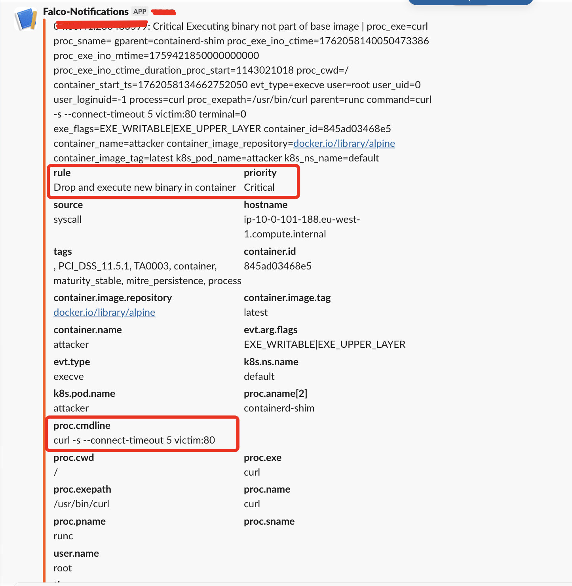
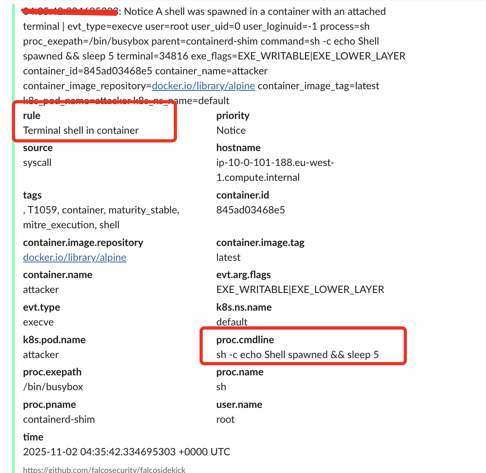

# Kubernetes Security Labs – Claudio Magagnotti

> **Cybersecurity Architect | 12+ Years in Cloud Security & DevSecOps**  
> **Azure AKS | AWS EKS | Zero Trust | CISSP (2025) | CKA | AZ-500**  
> **Spain | [clau.magagnotti@hotmail.com](mailto:clau.magagnotti@hotmail.com)**  

# LAB 3: Kubernetes Network Policies + Falco (EKS + Slack Alerts)
## ¿POR QUÉ FALCO?
Falco es la solución de facto para runtime security en Kubernetes, independientemente del proveedor cloud.
Azure y AWS ofrecen herramientas nativas (Defender for Containers, GuardDuty), pero:

- No tienen la granularidad de Falco (syscall-level detection)
- No son open-source ni multi-cloud
- No permiten reglas personalizadas tan flexibles

>**Falco detecta en tiempo real: shell spawn, binarios no autorizados, privilege escalation. Lo usamos porque es el estándar CNCF, funciona igual en EKS, AKS, GKE.
En producción, se integra con Slack, SIEM, SOAR. Es más potente que las herramientas nativas para entornos regulados."**
**"Falco es la solución de facto para runtime security en Kubernetes, independientemente del proveedor cloud.
Azure y AWS ofrecen herramientas nativas (Defender for Containers, GuardDuty), pero:

No tienen la granularidad de Falco (syscall-level detection)
No son open-source ni multi-cloud
No permiten reglas personalizadas tan flexibles

Falco detecta en tiempo real: shell spawn, binarios no autorizados, privilege escalation.
Lo usamos porque es el estándar CNCF, funciona igual en EKS, AKS, GKE.
En producción, se integra con Slack, SIEM, SOAR.
Es más potente que las herramientas nativas para entornos regulados."**

## **Objetivo del Laboratorio**
Demostrar **Zero Trust** en Kubernetes:
- **NetworkPolicy deny-all** → Bloquea todo tráfico
- **Falco** → Detecta shells y binarios no autorizados
- **Slack** → Alertas en tiempo real
- **Terraform + Helm + EKS** → 100% automatizado

---
## **📊 Metrics Hardening**
|Feature|Status|Prueba|
|-|-|-|
|NetworkPolicy deny-all|✅| Activo|curl victim:80 → BLOCKED|
|Falco runtime detection|✅| Activo|shell in container → Slack alert|
|Slack integration|✅| Activo|Real-time alerts|
|Custom rules|✅| Loaded|rules_files: /etc/falco/custom_rules/falco.yaml|

---
## **Deployed Architecture**

```text
EKS Cluster (t3.medium)
├── VPC (2 AZs + NAT)
├── NetworkPolicy deny-all (default namespace)
├── Falco (DaemonSet) → Detecta:
│   • Drop and execute new binary (curl)
│   • Terminal shell in container (sh -c)
├── Falcosidekick → Envía alertas a Slack
└── Attack: lateral-move.sh → curl + shell spawn
```
---


## **📸 Slack screenshots**
|Alert | Descr|
|-|-|
||Drop and execute new binary in container|
||Terminal shell in container|


## **Deploy in 5 Minutes**

```
# 1. Clone the repo
git clone https://github.com/Cyb3rK1ll/k8s-security-labs.git
cd k8s-security-labs/lab3-network-falco

# 2. Deploy
terraform init
terraform apply -auto-approve

# 3. Execute attack
./attack/lateral-move.sh
```

---

## **Custom Rules (falco_rules/falco.yaml)**
```
- rule: Test - Any shell via sh or bash with -c
  desc: Triggers when any shell with '-c' is launched inside a container (for testing)
  condition: >
    container
    and evt.type = execve
    and (proc.name = sh or proc.name = bash)
    and proc.cmdline contains "-c"
  output: >
    🔥 [Falco Test] Shell via sh/bash with -c (user=%user.name container=%container.id image=%container.image.repository command=%proc.cmdline)
  priority: NOTICE
  tags: [test, shell, container]
```
---
## **Evidence (included in /evidence)**
|File|Description|
|-|-|
|falco.log|Logs de Falco con detección de curl y sh -c|
|lateral-move|log,Log del ataque (bloqueo + shell spawn)|
|networkpolicy|yaml,NetworkPolicy deny-all|
|slack-alert-curl|png,Alerta de curl en Slack|
|slack-alert-shell|png,Alerta de sh -c en Slack|
---

## **🔧 Troubleshooting**
|Problem|Solution|
|-|-|
|Chart|yaml file is missing,helm pull falcosecurity/falco --version 7.0.0 --untar|
|context deadline exceeded|timeout = 900 + wait = true|
|CrashLoopBackOff|driver.kind: module + privileged: true|
|Driver API version mismatch|"driver.loader.version: ""3.0.0"""|
|No custom rule loaded|rules_files: /etc/falco/custom_rules/falco.yaml|
