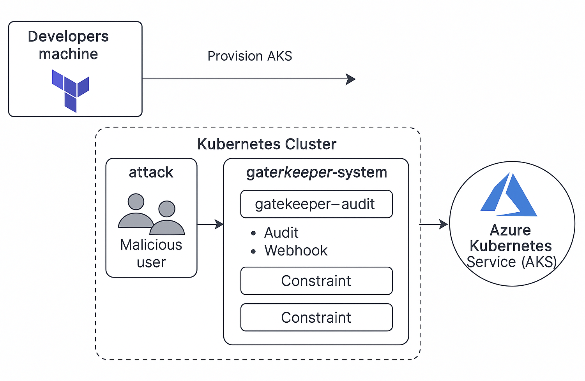
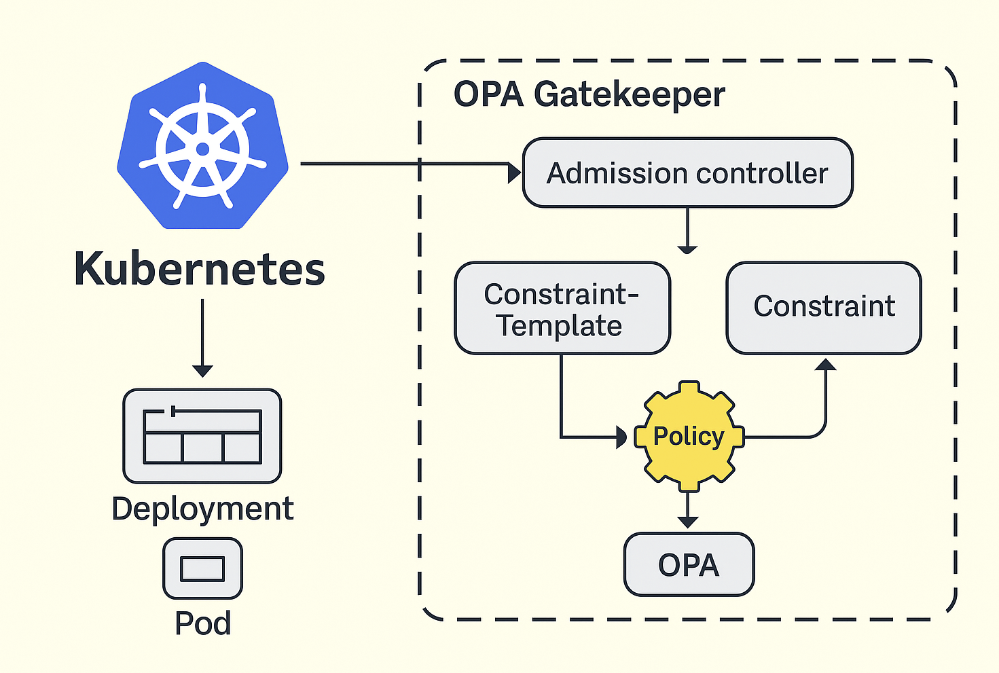
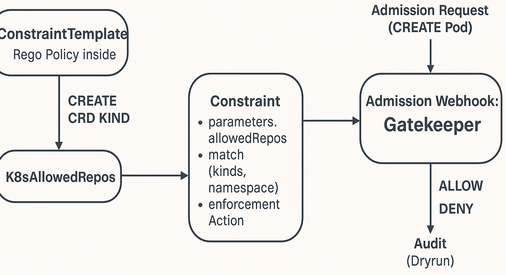

# LAB 5: OPA Gatekeeper + Pod Security Standards (AKS)
---
**Author**: Claudio Magagnotti  
**Cloud**: Azure AKS
**Deploy**: 5 minutes with Terraform  

---

## Executive Summary

This lab demonstrates the implementation of **OPA Gatekeeper** within an Azure Kubernetes Service (AKS) environment to enforce security policies through Policy as Code. By leveraging OPA Gatekeeper, organizations can automate the validation and enforcement of Pod Security Standards (PSS), ensuring that only compliant and secure workloads are deployed. This approach enhances governance, improves compliance with security standards, and reduces operational risks through automated policy enforcement integrated directly into the Kubernetes admission process.

## Problem Statement

In Kubernetes environments, governance and policy enforcement are critical to maintaining security, compliance, and operational consistency. Without automated controls, misconfigurations such as privileged containers or insecure volume mounts can expose clusters to vulnerabilities and compliance violations. Manual policy enforcement is error-prone and inefficient, making it essential to adopt tools like OPA Gatekeeper that provide real-time, declarative policy enforcement to safeguard workloads and streamline security governance.

---

## WHAT IS OPA GATEKEEPER?
OPA Gatekeeper is the Open Policy Agent admission controller for Kubernetes.  
Enable Policy as Code with Rego: validate, mutate or block resources in real time.  
In this lab, we use it to enforce Pod Security Standards (PSS):

- Baseline → No privileged, no hostPath  
- Restricted → No root, no capabilities

It is more flexible than Kyverno and more powerful than PodSecurityPolicies.  
Integrated with Falco for audit + Slack.  
It is CNCF standard, multi-cloud, open source.  
In production, it is combined with RBAC, NetworkPolicy and Falco for Zero Trust.

---

## 🎯 Lab Objective

The main objective of this lab is to demonstrate how to implement and use **OPA Gatekeeper** in an Azure Kubernetes Service (AKS) cluster to enforce security policies through **Policy as Code**. The goal is to validate, in real time, pod compliance with the **Pod Security Standards (PSS)**, specifically the **Baseline** and **Restricted** profiles, blocking insecure configurations such as privileged pods or pods running as root. Additionally, deployment is automated using Terraform and Helm to facilitate continuous integration and security governance in Kubernetes environments.

---

## 🏗️ Deployed Architecture

```text
AKS Cluster (Standard_B2s - Free Tier)
├── VNet (10.0.0.0/16) + Subnet (10.0.1.0/24)
├── Service CIDR: 172.16.0.0/16 (segregated)
├── OPA Gatekeeper → Enforces PSS:
│   • Baseline: No hostPath, no privileged
│   • Restricted: No root, no capabilities
├── Attack: run-attacks.sh → BLOCKED
└── Audit logs → Gatekeeper
```



---

## 🧱 Kubernetes Policy and Governance

Kubernetes governance can be divided into several layers to ensure policy compliance and security:

| Layer             | Description                                    | Example Tools                 |
|-------------------|------------------------------------------------|------------------------------|
| **RBAC**          | Role-based access control for users and services | Kubernetes RBAC              |
| **NetworkPolicy** | Network traffic control between pods           | Kubernetes NetworkPolicies   |
| **Policy as Code**| Declarative policy definition and enforcement for resources | OPA Gatekeeper, Kyverno      |
| **Auditing**      | Logging and monitoring of events and violations | Falco, Kubernetes Audit Logs |

OPA Gatekeeper operates at the **Policy as Code** layer, allowing validation and blocking of non-compliant resources before creation or modification.

---

## 🧠 OPA Gatekeeper Architecture and Functioning

OPA Gatekeeper functions as an **admission controller** that intercepts requests to the Kubernetes API Server to validate resources against policies defined in Rego. It consists of:

- **ConstraintTemplates**: Define policy logic in Rego.
- **Constraints**: Instances of policies applied with specific parameters.
- **Audit**: Module that reviews existing resources to detect violations.



---

## ⚙️ Example of Functioning: ConstraintTemplate + Constraint + Policy

### ConstraintTemplate (allowed-repos.yaml)

```yaml
apiVersion: templates.gatekeeper.sh/v1beta1
kind: ConstraintTemplate
metadata:
  name: k8sallowedrepos
spec:
  crd:
    spec:
      names:
        kind: K8sAllowedRepos
  targets:
    - target: admission.k8s.gatekeeper.sh
      rego: |
        package k8sallowedrepos

        violation[{"msg": msg}] {
          container := input.review.object.spec.containers[_]
          not startswith(container.image, allowed_repo)
          allowed_repo := input.parameters.allowedRepos[_]
          msg := sprintf("Container image '%v' is not from an allowed repository", [container.image])
        }
```

### Constraint (allowed-repos-constraint.yaml)

```yaml
apiVersion: constraints.gatekeeper.sh/v1beta1
kind: K8sAllowedRepos
metadata:
  name: allowed-repos
spec:
  match:
    kinds:
      - apiGroups: [""]
        kinds: ["Pod"]
  parameters:
    allowedRepos:
      - "myregistry.azurecr.io/"
      - "docker.io/library/"
```

### Policy (Rego logic inside the Template)

```rego
package k8sallowedrepos

violation[{"msg": msg}] {
  container := input.review.object.spec.containers[_]
  not startswith(container.image, allowed_repo)
  allowed_repo := input.parameters.allowedRepos[_]
  msg := sprintf("Container image '%v' is not from an allowed repository", [container.image])
}
```

This policy validates that every container image specified in a Pod begins with one of the allowed repository prefixes defined in the parameters. If any container image does not match the allowed repositories, the policy raises a violation and denies the creation or update of the Pod.

### Explanation


This policy checks if every container image in a pod starts with one of the allowed repository prefixes specified in the parameters. If a container image does not match any allowed repository, a violation is raised, blocking the pod creation or update.

---

### 📊 Visual Flow — Policy Enforcement Lifecycle

The following diagram illustrates how the **ConstraintTemplate**, **Constraint**, and **Rego Policy** interact during admission review and enforcement within Gatekeeper:



---

---

## Technical Implementation Summary

| Component         | Version / Details                 |
|-------------------|---------------------------------|
| AKS Cluster       | Standard_B2s (Free Tier)         |
| Terraform         | Used for infrastructure deployment |
| Helm              | Used to deploy OPA Gatekeeper   |
| OPA Gatekeeper    | Admission controller for policy enforcement |

---

## 🧪 Lab Results

| Test                          | Expected Result                | Actual Result                 |
|-------------------------------|-------------------------------|------------------------------|
| Apply privileged pod           | Creation blocked               | Pod blocked by Gatekeeper    |
| Apply pod with hostPath        | Creation blocked               | Pod blocked by Gatekeeper    |
| Apply pod running as root      | Creation blocked               | Pod blocked by Gatekeeper    |
| Apply valid Baseline pod       | Successful creation            | Pod created                  |
| Gatekeeper audit logs          | Violation logs recorded        | Logs generated               |

---

## Business Value and Benefits

- **Automated Enforcement:** Ensures consistent and real-time policy validation, reducing manual errors and operational overhead.
- **Compliance Alignment:** Enforces Pod Security Standards to meet organizational and regulatory security requirements.
- **Auditability:** Provides detailed audit logs for monitoring and forensic analysis, enhancing security visibility.
- **Cloud-Agnostic Design:** OPA Gatekeeper is open source and CNCF standard, enabling multi-cloud and hybrid cloud deployments.
- **Improved Security Posture:** Blocks insecure pod configurations proactively, reducing attack surface and risk exposure.

---

## 📊 Hardening Metrics

| Feature                    | Status      | Verification Command               |
|----------------------------|-------------|----------------------------------|
| OPA Gatekeeper             | ✅ Active    | `helm list -n gatekeeper-system` |
| PSS Baseline              | ✅ Enforced  | `kubectl apply -f attack/hostpath.yaml` → BLOCKED |
| PSS Restricted            | ✅ Enforced  | `kubectl apply -f attack/privileged.yaml` → BLOCKED |
| Audit logs                | ✅ Active    | `kubectl logs -n gatekeeper-system` |

---

## 🧾 Collected Evidence

| Path                             | Description                                                                 |
|----------------------------------|-----------------------------------------------------------------------------|
| `evidence/collect-evidence.sh`   | Script that gathers logs and generates the Markdown report.                 |
| `evidence/report.md`             | Consolidated report: audit summary, admission deny events, attack stderr.  |
| `evidence/gatekeeper-audit.log`  | Gatekeeper audit-controller logs (periodic cluster scans).                 |
| `evidence/gatekeeper-controllers.log` | Gatekeeper controller-manager/webhook logs.                           |
| `evidence/helm-values.yaml`      | Effective Helm values for the `gatekeeper` release.                         |
| `evidence/kubectl-apply-error.txt` | Global stderr from a `kubectl apply` run (if any).                       |
| `evidence/pods.txt`              | Snapshot of pods across all namespaces.                                     |
| `evidence/lab5-opa-aks.png`      | Lab architecture diagram.                                                   |
| `evidence/opa-gatekeeper-arch.png` | OPA Gatekeeper standard architecture diagram.                             |
| `evidence/attack-errors/`        | Folder with per-attack stderr files captured by `run-attacks.sh`.          |
| `evidence/attack-errors/cap.stderr`          | Deny evidence for capabilities escalation attempt.                |
| `evidence/attack-errors/hostnetwork.stderr`   | Deny evidence for `hostNetwork: true`.                              |
| `evidence/attack-errors/privileged.stderr`    | Deny evidence for `privileged: true`.                                |
| `evidence/attack-errors/runasnonroot.stderr`  | Deny evidence for `runAsNonRoot: false` (Restricted).               |

---

## Visual Summary

This lab follows a DevSecOps compliance flow: Developers commit code to Git repositories, triggering Terraform-based infrastructure provisioning and configuration. Helm charts deploy OPA Gatekeeper into the AKS cluster, where it enforces Pod Security Standards in real time during pod admission. Secure deployments are thus ensured, with audit logs continuously generated and monitored to maintain compliance and provide visibility into policy enforcement events.

---

## 💡 Conclusion

This lab demonstrates how **OPA Gatekeeper** enables robust governance in Kubernetes through declarative and automated policies. Integration with **Pod Security Standards** ensures that only secure pods are deployed, blocking risky configurations in real time. Additionally, combining with auditing tools like Falco and notification systems like Slack provides a comprehensive ecosystem to maintain security and compliance in production environments.