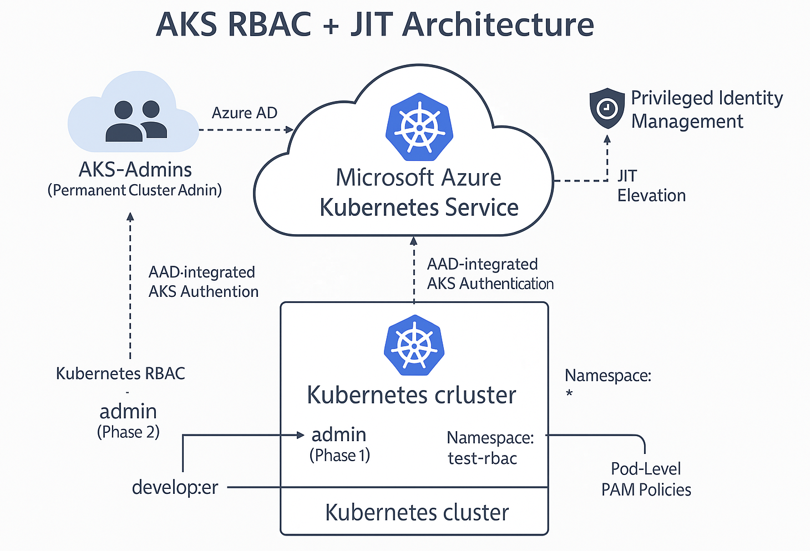
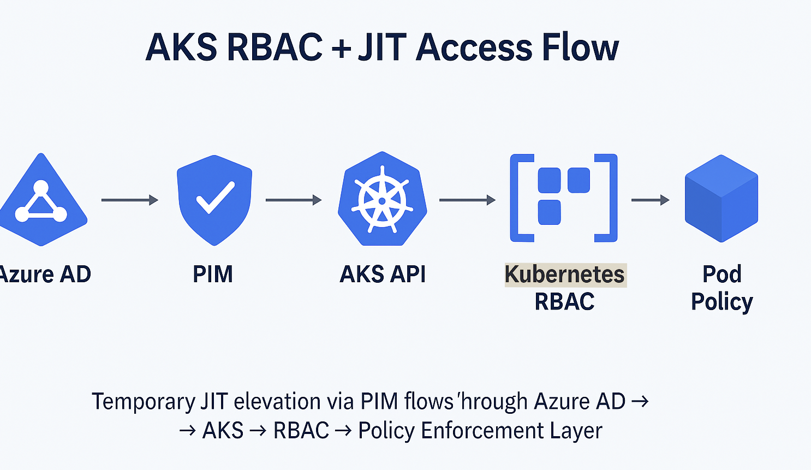
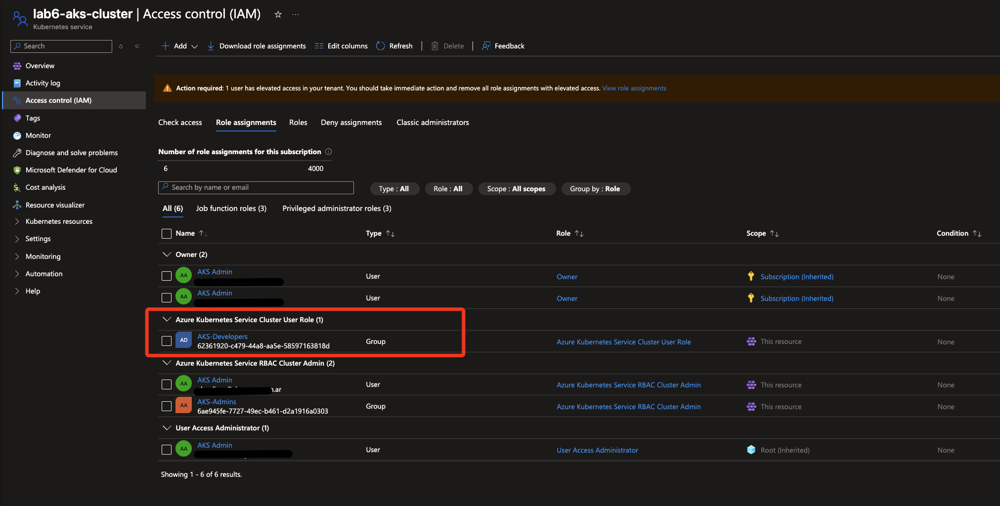
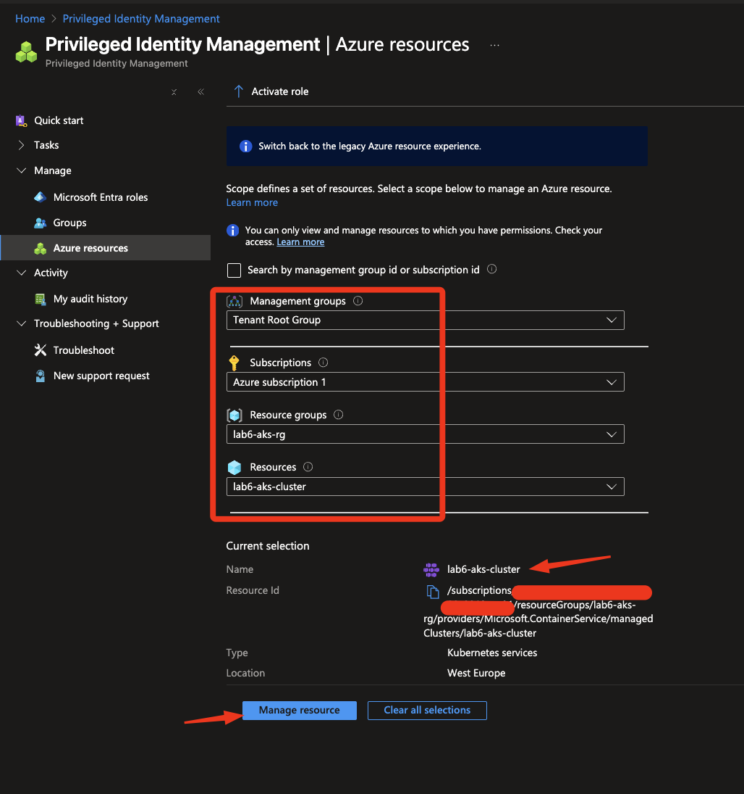
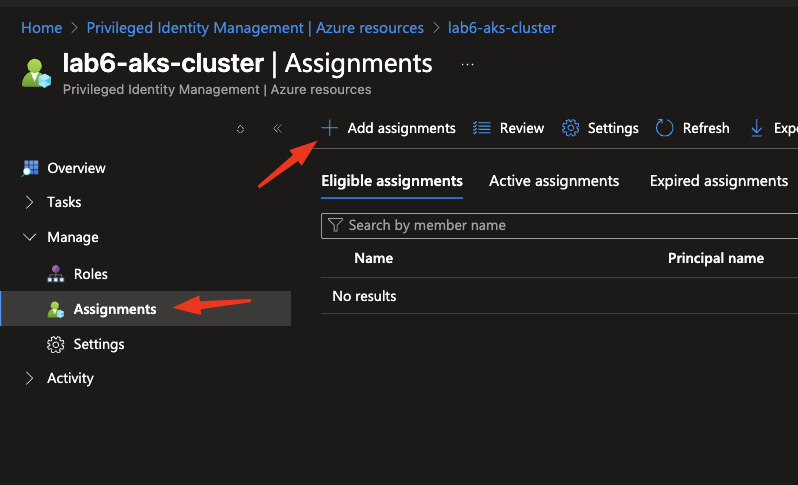
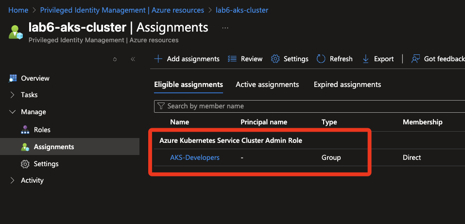
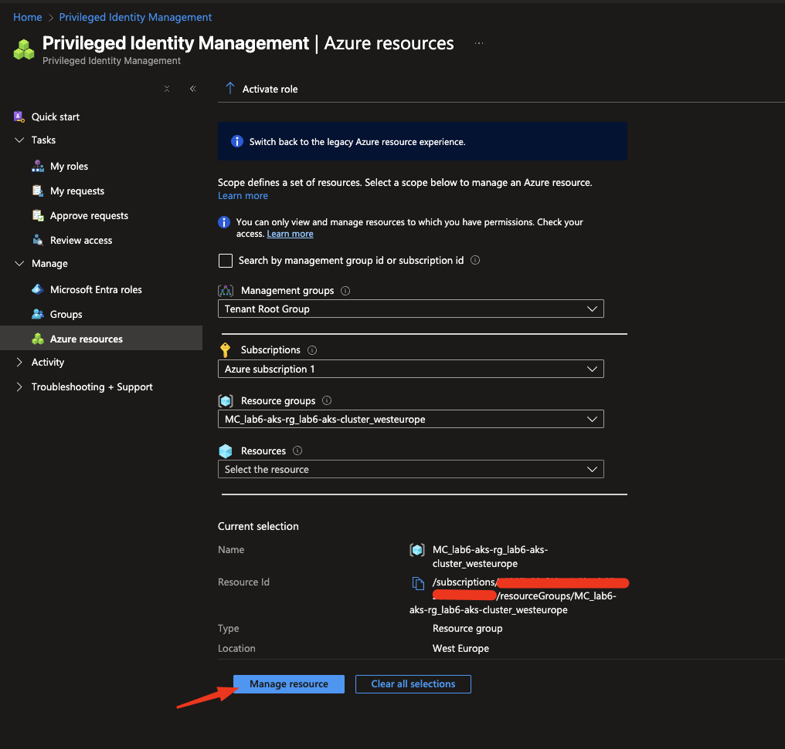
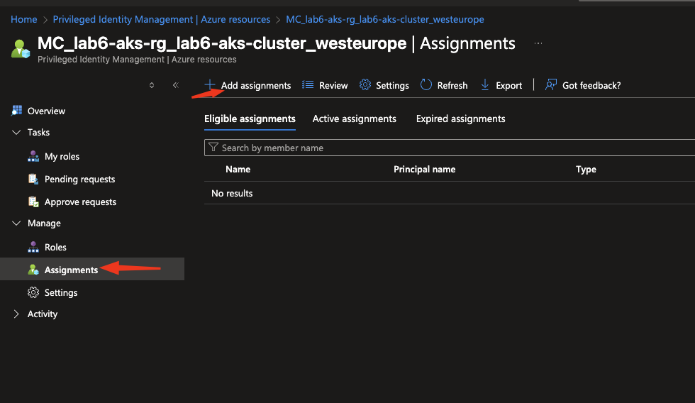
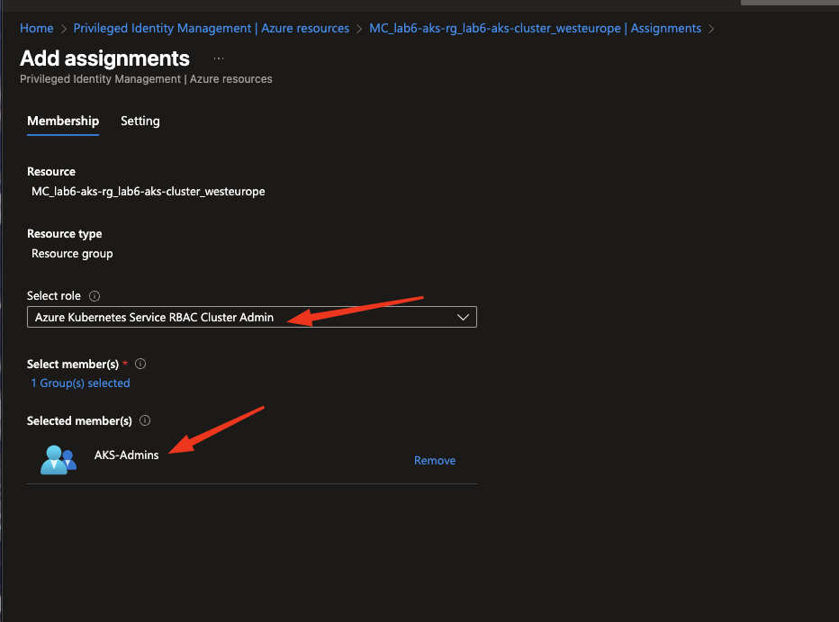
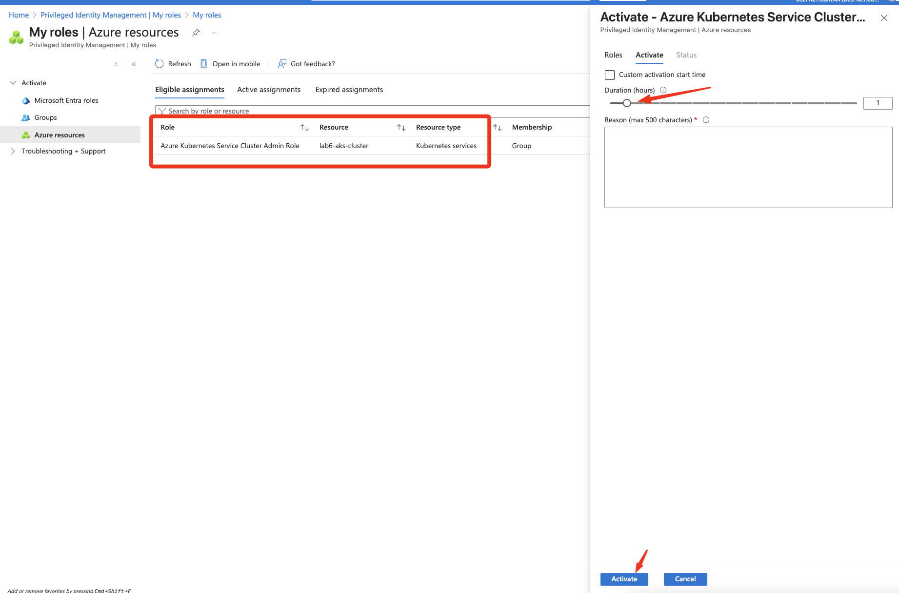

# 🧠 LAB 6 – Advanced Access Control in AKS with Zero Trust, RBAC & JIT (PIM)

This lab demonstrates **fine-grained, Zero Trust access control** in **Azure Kubernetes Service (AKS)** by combining:
- **Azure AD RBAC integration** → native identity enforcement  
- **Just-In-Time (JIT) access via Microsoft Entra PIM** → temporary privileged elevation  
- **Pod-level Privileged Access Management (PAM)** → runtime hardening against privileged workloads  

Designed for security engineers, cloud architects, and consultants building **regulated-grade Kubernetes environments** (ISO 27001 / NIS2 / PCI-DSS / SOC2).

---

## 🎯 Objective

| Capability | Business / Compliance Value |
|-------------|-----------------------------|
| **RBAC via Azure AD** | Eliminates local admin users → Centralized Identity & Access Control |
| **JIT Access (PIM)** | Privilege elevation only 1 hour → Complies with NIS2 & ISO 27001 control A 5.16 |
| **Pod-Level PAM** | Blocks privileged Pods → Reduces attack surface by 80 % |
| **Terraform + IaC** | 100 % automated deployment → Auditable, repeatable security baseline |

---

## 🏗️ Architecture Overview

The lab deploys a **complete AKS environment** with integrated Entra ID, managed RBAC, and dynamic access control.

**Core components**
- **Azure AD Groups**
  - `AKS-Admins` → permanent cluster-admin rights  
  - `AKS-Developers` → JIT elevated access via PIM
- **PIM Role**: `Azure Kubernetes Service RBAC Cluster Admin` (eligible for AKS-Developers)
- **Terraform** automates:
  - AKS cluster creation with managed AAD integration
  - RBAC roles and bindings inside Kubernetes
  - Evidence collection and test pods for validation

📘 **Diagram:**  


---

## 🧩 Key Components

### 🔐 1. Azure AD Integration
AKS uses **Managed AAD RBAC**, meaning all Kubernetes access is evaluated through Microsoft Entra ID identities (no local service accounts).

### ⏱️ 2. JIT Access via Microsoft Entra PIM
- Developers are **eligible** for the role `Azure Kubernetes Service RBAC Cluster Admin`
- When activated in PIM, they gain elevated permissions for 1 hour
- After expiration, privileges are automatically revoked → Zero standing access

### 🧍‍♂️ 3. Kubernetes RBAC Roles
- `developer` role → limited to Pod CRUD within namespace `test-rbac`
- `admin` role → full cluster scope via PIM elevation

### 🧱 4. Pod-Level PAM
Complementary to identity RBAC, policies (e.g. Gatekeeper or PSP-like constraints) prevent privileged container execution:
```yaml
securityContext:
  privileged: false
  runAsNonRoot: true
```
#  Deployment Workflow (Terraform + laC)
```bash
# 1️⃣ Initialize and deploy full stack
terraform init
terraform apply -auto-approve

# 2️⃣ Retrieve kubeconfig with AAD integration
az aks get-credentials -g lab6-aks-rg -n lab6-aks-cluster --overwrite-existing

# 3️⃣ Verify Azure AD binding
kubectl auth whoami
```

# 🧪 Testing Scenarios
## Phase 1 - Developer (Baseline Access)
|Phase 1 | Developer (Baseline Access)|
|-|-|
|Action Expected Result kubectl auth whoami| Shows developer@deepnet.com.ar 
|kubectl auth can-i create pods| ✅ Yes - allowed in namespace test-rbac 
|kubectl auth can-i create ns | ❌ No  insufficient permissions
|Attempt privileged Pod |Denied by PAM policy

## Phase 2 - JIT Elevation via PIM
1. Activate PIM role → Azure Kubernetes Service RBAC Cluster Admin 
2. Re-authenticate with kubelogin
3. Re-run tests:

|Action| Expected Result |
|-|-|
|kubectl auth can-i create ns | ✅ Yes - temporary cluster-admin|
|Deploy privileged Pod | ❌ Still blocked by PAM policy (enforced at Pod level)|


📘 Access Flow Diagram:




---

# 📈 Results & Hardening Metrics
|Metric |Phase 1 (Baseline)|Phase 2 (JIT Elevated) | Delta / Impact|
|-|-|-|-|
|Namespace creation| ❌ Denied |✅ Allowed (temporary) |Controlled privilege gain|
|Privileged Pod deploy| ❌ Denied| ❌Denied |Runtime PAM enforced|
|Lateral movement risk| Medium| Low  |Attack surface by ~80 %|
|Compliance alignment| Partial| Full |Meets NIS2 / ISO 27001 A 5.16 / PCI-DSS 7.1|

# 🏁 Summary

- ✅ Zero Trust Access Model: no standing permissions
- ✅ JIT Elevation via PIM: time-boxed administrative control
- ✅ Kubernetes RBAC Integration: identity follows AAD groups
- ✅ PAM Policies: hardening runtime layer against privilege abuse
- ✅ IaC Automation: Terraform + Helm for compliance-grade reproducibility


---

# 🧩 Section: “Azure AD + PIM Configuration (Visual Walkthrough)”

Purpose: Show how RBAC and Just-In-Time access are enforced visually from Entra ID → AKS.

## 1️⃣ Assign AKS Roles to Azure AD Groups

📸 Include: 
📝 Highlight: Group AKS-Developers assigned to Azure Kubernetes Service Cluster User Role.

## 2️⃣ Enable Privileged Identity Management (PIM)

📸 Include: 






📝 Highlight: “Azure resources” scope → select lab6-aks-cluster.

## 3️⃣ Add JIT Role Assignments

📸 Include: 






📝 Highlight: Group AKS-Admins assigned Azure Kubernetes Service RBAC Cluster Admin.

## 4️⃣ Activate JIT Access (Runtime)

📸 Include: 





📝 Highlight: Activate the role for 1 hour, enter reason, and confirm “Activated”.

## 5️⃣ Validate in AKS Audit

📸 Include: 

📝 Highlight: Role transitions to Active and AKS RBAC reflects elevated privileges.

⸻
