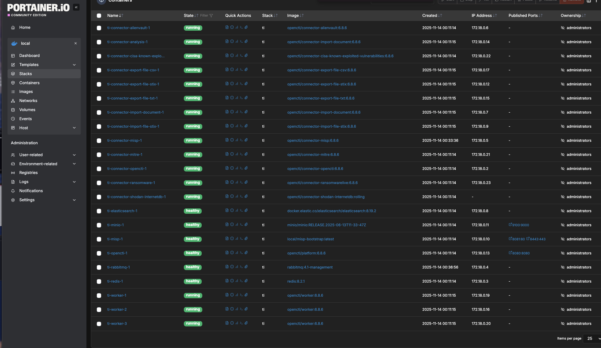

## OpenCTI + MISP Threat Intel Lab
---
**Author**: Claudio Magagnotti  

**Cloud**: AWS 

**Deploy**: 10 minutes with Terraform  

---
###  Summary
This repository contains an end‑to‑end cyber threat intelligence laboratory that I operate to demonstrate deep expertise in building, hardening, and automating modern CTI ecosystems. **It is not intended for production as‑is**; the objective is to validate the MISP + OpenCTI integration and highlight how quickly the stack can be provisioned (Terraformed EC2 baseline, Docker Compose orchestration, automated HAProxy/cert bootstrapping). A production rollout would require hardened IAM, managed secrets, multi‑AZ persistence, SIEM monitoring, and change‑control pipelines on top of this lab.

---

### Architecture

```
┌──────────────────────────────────────────────────────────────────────────┐
│                       🌐 Secure External Access Layer                    │
│                                                                          │
│  Cloudflare (WAF + TLS + Bot filtering)                                  │
│          │                                                               │
│          ▼ HTTPS (TLS 1.2+)                                              │
│  ┌────────────────────────────────────────────────────────────────────┐  │
│  │                         HAProxy Reverse Proxy                      │  │
│  │  • openc­ti.claumagagnotti.com:443                                  │  │
│  │  • misp.claumagagnotti.com:443                                     │  │
│  │  • portainer.claumagagnotti.com:443                                │  │
│  └────────────────────────────────────────────────────────────────────┘  │
└──────────────────────────────────────────────────────────────────────────┘
            │
            ▼ Internal Secure Loopback (127.0.0.1)

┌──────────────────────────────────────────────────────────────────────────┐
│                    🔐 Threat Intelligence Core Platform                  │
│                                                                          │
│  Docker Compose Stack (project: ti)                                      │
│                                                                          │
│  🧠 **OpenCTI Platform (6.8.x)**                                         │
│     • Graph-oriented CTI engine                                          │
│     • Worker pool (CTI workflows, queue-based)                           │
│     • Connectors: AlienVault, MITRE, Shodan, RansomwareLive, etc.        │
│                                                                          │
│  ⚡ ** MISP (Customized)**                                                 │
│     • Built on harvarditsecurity/misp                                    │
│     • Auto-bootstrap: MariaDB, admin user, TLS base URL, feeds           │
│     • Preconfigured for connector sync with OpenCTI                      │
│                                                                          │
│  📦 **Supporting Services**                                              │
│     • Redis — caching + job queues                                       │
│     • Elasticsearch 8.19 — search + indexing                             │
│     • RabbitMQ 4.1 — event orchestration                                 │
│     • MinIO — S3 object storage for OpenCTI attachments                  │
│                                                                          │
│  🗄 **Persistent Data (Docker volumes)**                                 │
│     • esdata, redisdata, amqpdata                                        │
│     • misp-db, misp-files, s3data                                        │
└──────────────────────────────────────────────────────────────────────────┘

                     🔎 Analyst & Threat Hunter Access (Secure HTTPS)
```

---

### Why pair MISP and OpenCTI?

| Capability | MISP | OpenCTI | Combined value |
| ---------- | ---- | ------- | -------------- |
| IOC/TTP capture | ✓ (events, attributes, galaxies) | ✓ (STIX 2.1 graph) | MISP excels at ingesting raw indicators; OpenCTI contextualizes them with relationships. |
| Automation & sync | Feeds, PyMISP, taxonomies | Connectors, workers, data lake | The MISP connector streams curated events straight into OpenCTI for enrichment, scoring, and sharing. |
| Sharing & governance | Tagging (e.g., TLP), org scoping | Workspaces, cases, knowledge base | TLP tags in MISP drive OpenCTI ingestion policies and downstream access control. |
| Scalability | Lightweight, event‑centric | Horizontal workers, graph DB | Combined deployment separates curation (MISP) from analytics (OpenCTI) and scales each independently. |

Operating them together lets me prove expertise across: secure containerization, certificate management, HAProxy TLS termination, data persistence, and CTI process automation end‑to‑end.

---

### Technical Highlights

1. **Custom MISP bootstrap** (`misp-image/bootstrap-db.sh`)
   - Runs `mysql_install_db`, seeds tables, and executes Cake shells (`user_init`, `Admin setSetting`, `Baseurl`) non‑interactively.
   - Hashes passwords via Cake’s `BlowfishPasswordHasher` directly from Bash, guaranteeing deterministic admin credentials.
   - Enforces `Security.password_policy_length` and `MISP.baseurl` on every start, even when volumes already exist.
   - Supports both legacy (`MISP_ADMIN_EMAIL`) and camelCase (`MISP_admin_email`) env variables to match upstream expectations and external orchestrators (Portainer).

2. **Comprehensive Docker Compose stack**
   - Health checks on every core service (Redis, Elasticsearch, MinIO, RabbitMQ, OpenCTI, MISP).
   - Workers replicated (`deploy.replicas=3`) to showcase horizontal scaling.
   - 13 OpenCTI connectors configured with UUIDs, tokens, TLS trust bundles, and ISO8601 schedules (`CONNECTOR_DURATION_PERIOD`, `PT30M`, `PT1H`, etc.).
   - MinIO exposed only on loopback (`127.0.0.1:9100`) and consumed internally by OpenCTI, eliminating lateral movement surface.

3. **Secure ingress with HAProxy**
   - Script `scripts/setup-haproxy.sh` provisions HAProxy, generates self‑signed wildcard certificates (`*.claumagagnotti.com`), concatenates PEM chains, validates config, and restarts the service.
   - HAProxy enforces TLS 1.2+, strict cipher suites, HTTP→HTTPS redirects, HSTS headers, and SNI‑based routing (`opencti`, `misp`, `portainer`).

4. **Operational automation**
   - Compose project name parameterization (`COMPOSE_PROJECT_NAME=ti`) avoids port collisions and allows parallel lab instances.
   - Portainer stack updates re‑use the locally built `local/misp-bootstrap:latest` image without requiring registry pushes.
   - `README` + `.env` document exact secrets, tokens, and ISO timestamps for connectors, aligning with production hardening practices.

---

### Deployment Guide

1. **Prerequisites**
   - AWS account with permissions to launch EC2, VPC, and IAM resources (Terraform workflow provisions everything in AWS).
   - Ubuntu 22.04 LTS host (local or EC2) with 4 vCPUs, 16 GB RAM, 200 GB SSD if you run the stack manually outside AWS.
   - Docker 27+ and Docker Compose plugin.
   - `git`, `curl`, `openssl`, and an outbound connection to Docker Hub.
   - DNS records for `opencti.claumagagnotti.com`, `misp.claumagagnotti.com`, `portainer.claumagagnotti.com` pointing to the HAProxy host (optional but recommended).

2. **Clone and configure**
   ```bash
   git clone https://github.com/<your-user>/opencti-misp-lab.git
   cd opencti-misp-lab
   cp .env.sample .env   # (if provided) or edit existing .env with strong secrets
   ```
   Edit `.env`:
   - `OPENCTI_ADMIN_TOKEN`: UUIDv4 from OpenCTI (or pre-generated).
   - `MISP_admin_email`, `MISP_admin_pw`, `MISP_authkey`: credentials for the MISP admin user and API key.
   - Connector IDs (`CONNECTOR_*_ID`) and API keys (AlienVault, etc.).

3. **Provision automatically with Terraform (optional)**
   If you want Terraform to launch the EC2 host, copy `misp-image/`, `docker-compose.yml`, `.env`, run the HAProxy script, build `local/misp-bootstrap` and start the stack automatically:
   ```bash
   cd terraform
   terraform init
   terraform apply \
     -var "key_pair_name=<aws-keypair>" \
     -var "ssh_private_key_path=$HOME/.ssh/<aws-keypair>.pem" \
     -var "haproxy_cert_cn=*.claumagagnotti.com"
   ```
   When `terraform apply` finishes, the stack is already running under `/opt/misp` on the created host. Jump to the “MISP First-Run Checklist”.

4. **Bootstrap HAProxy manually (if not using Terraform)**
   Use the automated script under `scripts/` (it copies `haproxy.cfg`, generates the wildcard cert, validates and restarts HAProxy):
   ```bash
   sudo CERT_CN="*.claumagagnotti.com" CONFIG_SRC="scripts/haproxy.cfg" scripts/setup-haproxy.sh
   ```

5. **Build custom MISP image**
   The compose file references `./misp-image/Dockerfile`; build it once so the locally tagged `local/misp-bootstrap:latest` exists:
   ```bash
   docker compose build misp
   ```

6. **Launch the stack**
   ```bash
   COMPOSE_PROJECT_NAME=ti docker compose up -d
   ```
   Monitor health:
   ```bash
   docker compose ps
   docker logs -f ti-opencti-1
   docker logs -f ti-misp-1
   ```

7. **Populate MISP & verify ingestion**
   - Log into `https://misp.claumagagnotti.com`, create a local org, tag events with `TLP:CLEAR`, publish them.
   - Force the connector to run: `docker restart ti-connector-misp-1`.
   - In OpenCTI (`https://opencti.claumagagnotti.com`), go to `Data → Ingestion → MISP` and confirm `processed_events_count > 0`.

8. **Maintenance**
   - Rotate secrets directly in `.env`, then `docker compose up -d --build misp connector-misp`.
   - Use Portainer or `docker volume rm` to reset lab data between demos.

---

### MISP First-Run Checklist

1. **Access & harden**
   - Browse to `https://misp.claumagagnotti.com` and log in with `misp-admin@claumagagnotti.com / changeMeMispAdmin!`.
   - Immediately rotate the password (`Administration → List Users → Edit`).
   - Ensure `MISP.baseurl` matches your public URL (`Administration → Server Settings & Maintenance → Security`).
   - Under `MISP → Global tags`, confirm the taxonomy `TLP:CLEAR` exists (or create it: Add Tag → Name `TLP:CLEAR`, Colour `#008000`, Hide Tag `false`).

2. **Create your organisation**
   - `Administration → List Organisations → Add Organisation`.
   - Example: Name `Claumagagnotti CTI`, domain `claumagagnotti.com`, mark “Local organisation”.
   - Assign yourself to it (`Administration → List Users → Edit → Organisation`).

3. **Seed events quickly**
   - **Manual event:** `Events → Add Event`, set Distribution “This community only”, Threat Level “Low”, Analysis “Initial”. Add Tag `TLP:CLEAR`. Save, then add Attributes (e.g., domain/IP/URL) and publish.
   - **Template-driven:** `Events → Add Event → Template` (e.g., “Ransomware”), fill the wizard, remember to add `TLP:CLEAR`, then publish.
   - **Feed ingestion:** `Sync Actions → List Feeds`. Enable a feed (CIRCL OSINT), set `Target Tag = TLP:CLEAR`, click “Fetch and store all feed data” then “Push all feed data”.

4. **Enforce tagging**
   - Inside each event, use the “Tags” button to add `TLP:CLEAR`.
   - For feeds, set `Target Tag` or `Tag Event` so imported events inherit `TLP:CLEAR`.

5. **Verify publishing**
   - `Events → List Events` should show at least one published event (unlocked icon) with column `Tag = TLP:CLEAR`.

6. **Trigger OpenCTI ingestion**
   - Connector runs every `CONNECTOR_MISP_DURATION_PERIOD` (default `PT1H`). To force: `docker restart ti-connector-misp-1` or tail logs: `docker logs -f ti-connector-misp-1`.
   - In OpenCTI go to `Data → Ingestion → Monitoring → MISP` and confirm `Last run`/`Processed events`.
   - Imported data appears under `Data → Entities → Reports` and `Threats → Indicators`. Use `Filters → Created by = MISP`.

7. **Extra population ideas**
   - Upload STIX/CSV: `Event Actions → Import from STIX` or `Upload sample`.
   - Sync from another MISP: `Sync Actions → List Instances`.
   - Scripted ingestion: use PyMISP to call `/events/add`, always tagging `TLP:CLEAR`.
   - Adjust `.env` (`MISP_IMPORT_FROM_DATE`) to control the initial window the connector fetches.

---

### Visual Walkthrough

| Screenshot | Description |
| --- | --- |
|  | "Portainer view" showing the running stack and health of the containers. |
|  | OpenCTI Dashboard |
|  | OpenCTI “Data → Ingestion → MISP Connector” screen with connectors reporting ACTIVE status. |
|  | Detail of a connector card (status, last run, manager deployment). |
|  | MISP “Sync Actions → List Feeds” page showing how CIRCL OSINT feed is enabled/tagged. |
|  | MISP "TLP:CLEAR" Tag configured. |
|  | MISP Feeds with Tag "TLP:CLEAR" assigned. |
|  | MISP "testing event" manually added for seeding workflow (Distribution/Threat Level/Analysis). |
|  | OpenCTI showing manual event "Testing event" ingested. |
|  | Domain Attribute from "Testing event". |
---
wdawdawaw

awdawdawaw
dawdawdawd
awdawdaw
dwadwadawd
wadwa