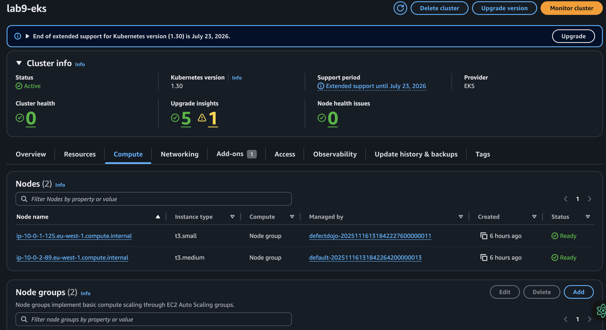
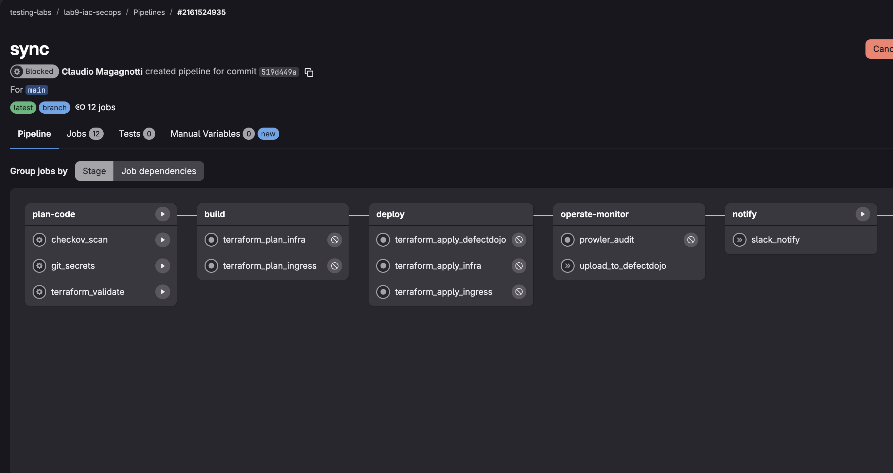
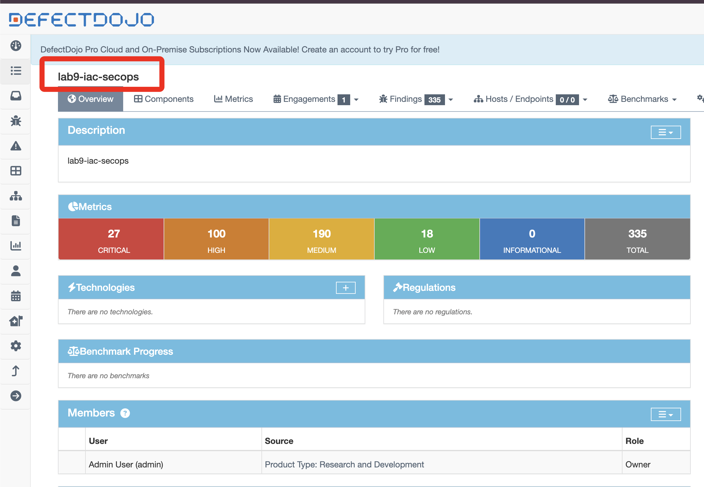
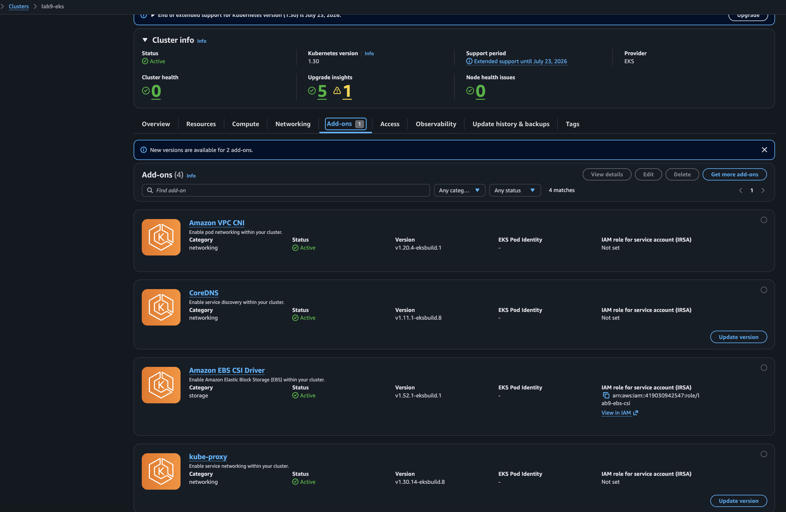
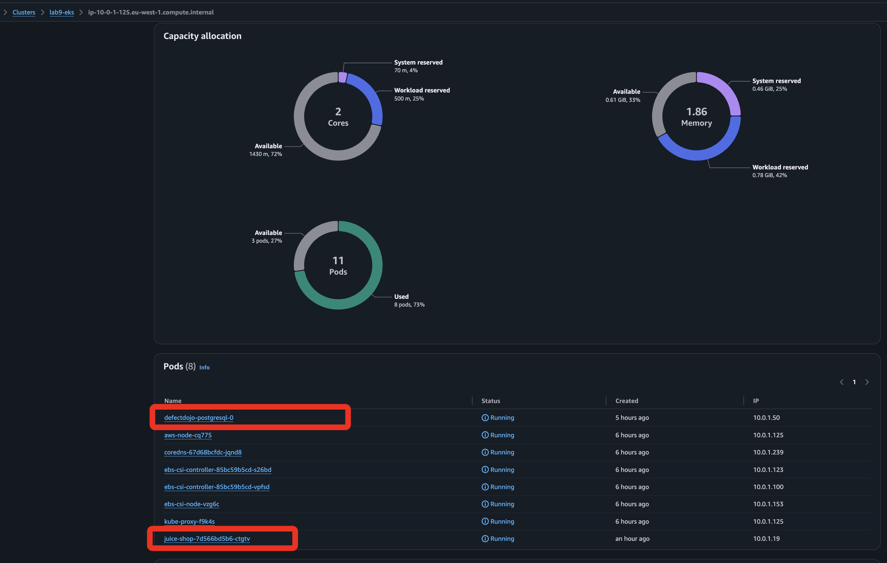
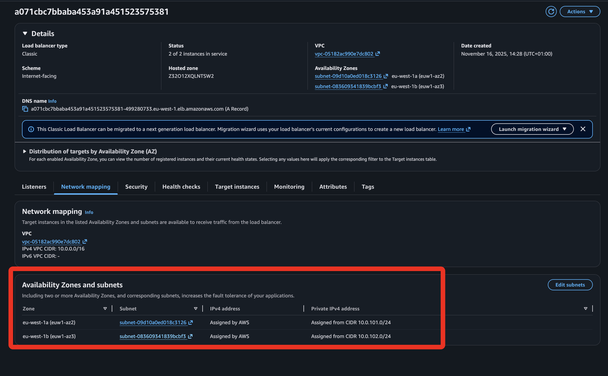
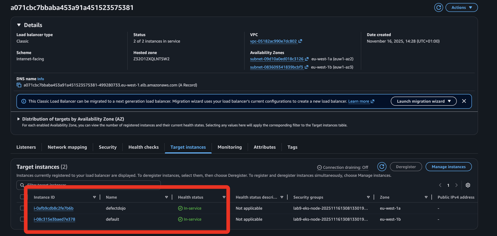

## 🚀 Lab 8 – IaC + SecOps on AWS/EKS (GitLab OIDC)

---
**Author**: Claudio Magagnotti  

**Cloud**: AWS 

**Deploy**: 20 minutes with Terraform  

---

This lab provisions, secures, and operates a real workload on AWS/EKS using Terraform and GitLab CI with OIDC (no long‑lived keys). It is written to be portfolio‑friendly for recruiters and peers while remaining technically detailed so others can reproduce it end‑to‑end.

At a glance it demonstrates:
- Production‑ready VPC + EKS provisioning.
- Built‑in security: Checkov (IaC), Gitleaks/TruffleHog (secrets), Prowler (cloud), centralized in DefectDojo.
- Federated trust via GitLab OIDC → AWS (short‑lived credentials only).
- Ingress with Traefik + TLS and application deployment (DefectDojo) via Helm/Terraform.
- Reproducible pipeline with manual gates and auditable artifacts.

## 🧱 High‑Level Architecture
- AWS VPC with public/private subnets, Internet/NAT Gateways, and EKS tagging.
- EKS 1.30 add‑ons: `vpc-cni`, `kube-proxy`, `coredns`, `aws-ebs-csi-driver` (via IRSA).
- Ingress: Traefik + cert‑manager (Let’s Encrypt) delivering HTTPS to the app.
- Security app: DefectDojo deployed via Helm with managed secrets and correct `ALLOWED_HOSTS`/`CSRF`.
- CI/CD (GitLab): OIDC to AWS, IaC/secret scanning, plan/apply, post‑deploy Prowler, push findings to DefectDojo, Slack notify.

## 🗂️ Repository Structure
- `main.tf`, `providers.tf`, `variables.tf`, `outputs.tf`: root stack (VPC, EKS, add‑ons, ECR, IAM/OIDC, SG rules).
- `modules/ingress`: Traefik + cert‑manager (ClusterIssuer) when using `terraform-ingress`.
- `terraform-ingress`: standalone Terraform project for the ingress layer.
- `modules/defectdojo`: Helm module hardened for host/CSRF/TLS/resources/secrets.
- `terraform-defectdojo`: standalone Terraform project to deploy DefectDojo into the cluster.
- `.gitlab-ci.yml`: full pipeline (validate, security, plan/apply per stack, post‑deploy, reporting).
- `scripts/normalize_prowler_report.py`: converts Prowler ASFF into DefectDojo‑friendly JSON.

## ✅ Requirements
- Terraform >= 1.9
- AWS CLI with adequate permissions or GitLab CI with OIDC enabled.
- A public domain for ingress (`domain_name`) pointing to Traefik’s Load Balancer (or external DNS).
- Costs: this lab creates EKS, NAT, LBs, EBS; destroy when done.

Im ## ⚙️ Key Variables
- Root stack: region, project name (see `variables.tf`).
- Ingress (`terraform-ingress`): Traefik/cert‑manager configuration.
- DefectDojo (`terraform-defectdojo/variables.tf`):
  - `cluster_name` (default `lab9-eks`)
  - `domain_name` (e.g., `defectdojo.example.com`)
  - `defectdojo_chart_url` (pinned chart)
  - `storage_class` (e.g., `gp2`)

## 🏃 Quick Start (CI/CD)
1) Push to `main` or open a MR (manual‑first pipeline).
2) Deploy in order (all manual):
   - `terraform_apply_infra` → VPC/EKS/add‑ons/ECR
   - `terraform_apply_ingress` → Traefik + cert‑manager
   - `terraform_apply_defectdojo` → DefectDojo
3) Post‑deploy and reports:
   - `prowler_audit` → AWS audit (artifacts `output/` + `prowler_report.json`)
   - `upload_to_defectdojo` → upload Checkov/Prowler/Secrets to DefectDojo

## 🧪 Quick Start (local)
- Root stack:
  - `AWS_PROFILE=<profile> terraform init`
  - `AWS_PROFILE=<profile> terraform apply -auto-approve`
- Ingress:
  - `AWS_PROFILE=<profile> terraform -chdir=terraform-ingress init`
  - `AWS_PROFILE=<profile> terraform -chdir=terraform-ingress apply -auto-approve`
- DefectDojo:
  - `AWS_PROFILE=<profile> terraform -chdir=terraform-defectdojo init`
  - `AWS_PROFILE=<profile> terraform -chdir=terraform-defectdojo apply -auto-approve`

Quick verification:
- `kubectl -n defectdojo get pods -o wide`
- `kubectl -n defectdojo get ingress`
- `curl -I https://<your-domain>/login`

Admin credentials (auto‑generated):
- `AWS_PROFILE=<profile> terraform -chdir=terraform-defectdojo output -raw defectdojo_admin_password`
- or: `kubectl -n defectdojo get secret defectdojo -o jsonpath='{.data.DD_ADMIN_PASSWORD}' | base64 -d`

## 🔐 Built‑in Security
- OIDC GitLab → AWS: ephemeral creds, no static keys in CI.
- Checkov: Terraform policies (with external modules) and JSON artifacts for review.
- Gitleaks/TruffleHog: dual secret scanners (files + history), results uploaded to DefectDojo.
- Prowler: AWS Foundational Security Best Practices post‑deploy; converted to DefectDojo‑friendly JSON.
- DefectDojo: single source of truth for vuln management.

## 🧭 Implementation Notes (DefectDojo)
- The module sets `host/siteUrl`, `ALLOWED_HOSTS`, `CSRF_TRUSTED_ORIGINS`, and `SECURE_PROXY_SSL_HEADER` for HTTPS behind Traefik.
- Secrets (admin, secretKey, credentialKey, metrics) managed via Terraform as a `kubernetes_secret`; Helm release depends on it.
- uWSGI resources tuned to avoid OOM restarts.

## 🧹 Safe Destroy
Recommended order:
- `terraform destroy -chdir=terraform-defectdojo -auto-approve`
- `terraform destroy -chdir=terraform-ingress -auto-approve`
- `terraform destroy -auto-approve`

Common issues:
- ECR not empty → configured `force_delete = true` (apply before destroying if coming from older state).
- IGW/Subnets dependency → delete LoadBalancer Services (Traefik/DefectDojo) then wait for ELB/NLB + ENIs to disappear. Handy: `kubectl get svc -A | grep LoadBalancer`.

## 🧩 Pipeline (job summary)
- `terraform_validate` → init/validate
- `checkov_scan` and `git_secrets` → JSON artifacts
- `terraform_apply_infra` (manual)
- `terraform_apply_ingress` (manual)
- `terraform_apply_defectdojo` (manual)
- `prowler_audit` → `output/` + `prowler_report.json`
- `upload_to_defectdojo` → send findings

## ❓ Troubleshooting
- 404/502 on login: check `kubectl -n defectdojo get ingress` host and `defectdojo-django` pod logs (`-c nginx`/`-c uwsgi`).
- Admin credentials: use the output/secret commands; if changed, restart the `django` pod.
- EBS CSI slow to `ACTIVE`: verify IRSA role (`AmazonEBSCSIDriverPolicy`) and re‑apply the add‑on.
- `hashicorp/kubectl` provider is not used; this project uses `gavinbunney/kubectl` where required.

## 📣 Why it matters
- Demonstrates end‑to‑end autonomy: cloud, IaC, security, CI/CD, observability.
- Uses modern practices: OIDC, IaC SAST, secret scans, compliance.
- Reproducible and didactic: anyone can follow and see results.

## 🔗 References
- OWASP DevSecOps: https://owasp.org/www-project-devsecops-guideline/
- GitLab CI OIDC → AWS: https://docs.gitlab.com/ee/ci/cloud_services/
- Checkov: https://www.checkov.io/
- Prowler: https://docs.prowler.com/
- DefectDojo: https://www.defectdojo.org/

If this helped, link it in your profile to tell a clear, hands‑on DevSecOps story for IaC.

## 🗺️ Infra Diagram
Visual representation of the main AWS/EKS resources (see also `docs/infra-diagram.mmd`).

### Evidence/Screenshots

- Screenshot 1
  
- Screenshot 2
  
- Screenshot 3
  
- Screenshot 4
  
- Screenshot 5
  
- Screenshot 6
  
- Screenshot 7
  
- Screenshot 8
  
